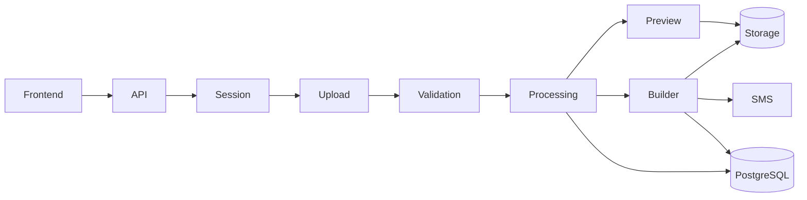

# Component Interaction

```mermaid
flowchart LR

Frontend

API

Session

Upload

Validation

Processing

Preview

Builder

SMS

DB[(PostgreSQL)]

Storage[(Storage)]

Frontend --> API

API --> Session

Session --> Upload

Upload --> Validation

Validation --> Processing

Processing --> Preview

Processing --> Builder

Builder --> Storage

Processing --> DB

Preview --> Storage

Builder --> DB

Builder --> SMS
```

## Purpose

Shows how the major application components collaborate during report processing.