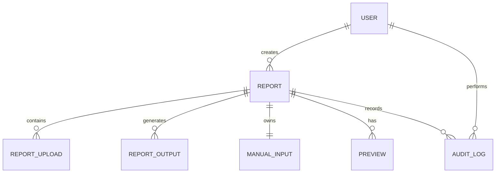

# Conceptual Database ERD

```mermaid
erDiagram

REPORT ||--o{ REPORT_UPLOAD : contains

REPORT ||--o{ REPORT_OUTPUT : generates

REPORT ||--|| MANUAL_INPUT : owns

REPORT ||--o{ PREVIEW : has

REPORT ||--o{ AUDIT_LOG : records

USER ||--o{ REPORT : creates

USER ||--o{ AUDIT_LOG : performs
```

## Purpose

Illustrates the high-level relationships between the core business entities.