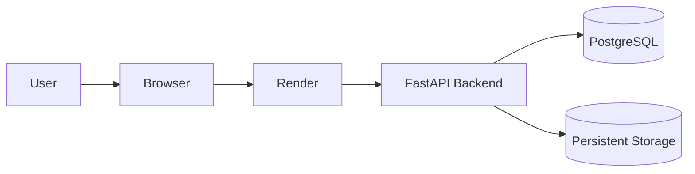

# Deployment Architecture

```mermaid
flowchart LR

User

Browser

Render

FastAPI[FastAPI Backend]

Postgres[(PostgreSQL)]

Disk[(Persistent Storage)]

User --> Browser

Browser --> Render

Render --> FastAPI

FastAPI --> Postgres

FastAPI --> Disk
```

## Purpose

Illustrates the deployment architecture of DRMA-v2 in production.