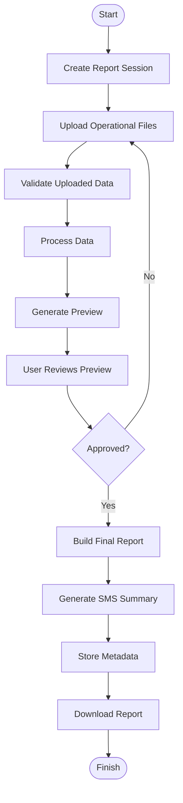

# Report Lifecycle Flow

```mermaid
flowchart TD

Start([Start])

Create[Create Report Session]

Upload[Upload Operational Files]

Validate[Validate Uploaded Data]

Process[Process Data]

Preview[Generate Preview]

Review[User Reviews Preview]

Decision{Approved?}

Build[Build Final Report]

SMS[Generate SMS Summary]

Store[Store Metadata]

Download[Download Report]

End([Finish])

Start --> Create
Create --> Upload
Upload --> Validate
Validate --> Process
Process --> Preview
Preview --> Review

Review --> Decision

Decision -- No --> Upload

Decision -- Yes --> Build

Build --> SMS
SMS --> Store
Store --> Download
Download --> End
```

## Purpose

Illustrates the complete business workflow from report creation to report download.