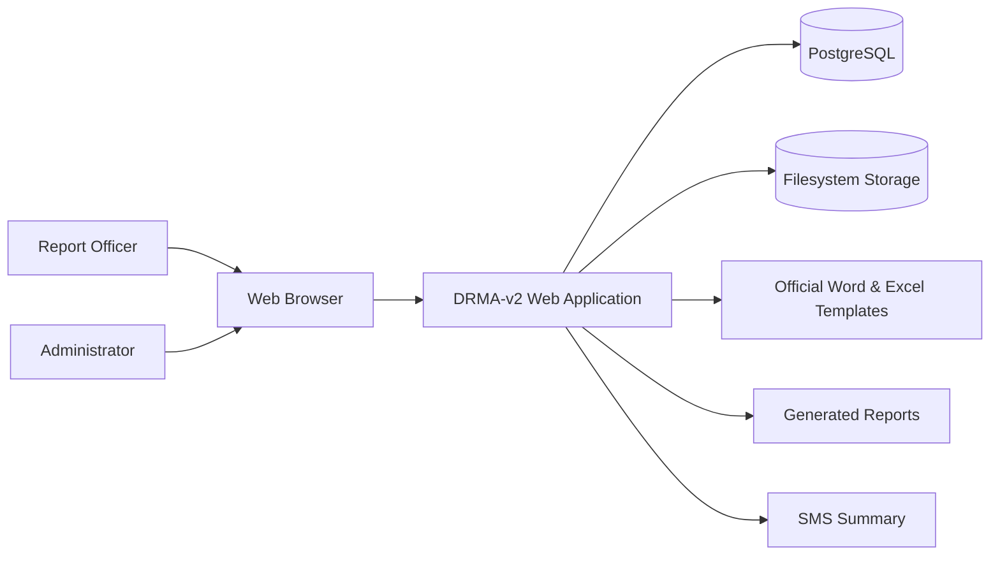

# System Context Diagram

This diagram illustrates the external actors and major systems interacting with DRMA-v2.

## Purpose

This diagram provides a high-level overview of the DRMA-v2 ecosystem, showing the main actors and external resources that interact with the application.