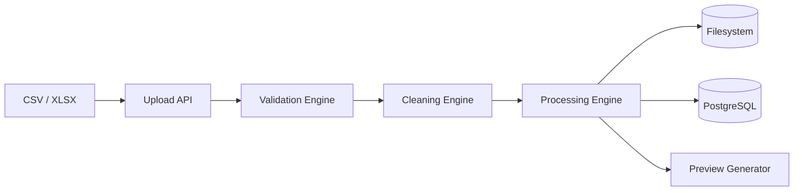

# Upload Processing Pipeline

```mermaid
flowchart LR

CSV[CSV / XLSX]

Upload[Upload API]

Validation[Validation Engine]

Cleaning[Cleaning Engine]

Processing[Processing Engine]

Storage[(Filesystem)]

Metadata[(PostgreSQL)]

Preview[Preview Generator]

CSV --> Upload

Upload --> Validation

Validation --> Cleaning

Cleaning --> Processing

Processing --> Storage

Processing --> Metadata

Processing --> Preview
```

## Purpose

Shows how uploaded datasets are transformed into processed report sections.